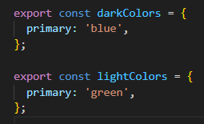
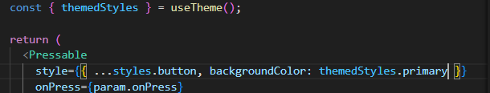
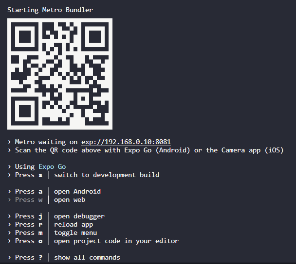

# pimi-connect-app

[](https://github.com/grupadotnet/pimi-connect-app/actions/workflows/lint.yml)

## Project structure

### We use a feature-based approach in our project so we keep all files related to a specific feature close to each other

### We keep tests close to the tested files

- **_/components_** - `global reusable components in a whole app`

- **_/features_** - `ready to use application features that work independently from each other`

- **_/screens_** - `screens of the application (same as views in a web)`

- **_/controllers_** - `api connection functions`

- **_/types_** - `global typescript types`

- **_/utils_** - `helper functions that are reusable in a whole app`

- **_/hooks_** - `global custom hooks reusable in a whole app`

#### **! All tests, styling files, feature-specific hooks, utils, etc. should be stored directly in the feature itself !**


## Styling

### File **_style.ts_** contains all the global styling that is being used in the app (flex, grid, variables, etc.)

`You should declare all reusable stylings there`

## Theming



### Example of how do we declare colors for different themes



### Example of how do we use themes in component

## Form

### When we want to create a form, we use an external library called _react-hook-form_

If you are new to _react-hook-form_ library then we recommend you create your form along with documentation: https://react-hook-form.com/get-started

## ESlint

### When pushing the branch to the remote repo there shouldn't be any eslint error as well as warning

### To sort imports:


## Start development

- Clone repository

```
git clone https://github.com/grupadotnet/pimi-connect-app.git
```

- Make sure u have yarn installed (or even node)

**To install node:**
https://nodejs.org/en/download

**To install yarn (in any terminal):**

```
npm install -G yarn
```

- Install required dependencies

**In a project main directory:**

```
yarn
```

- start app

```
yarn start
```

`In the end, your terminal should look like this`

